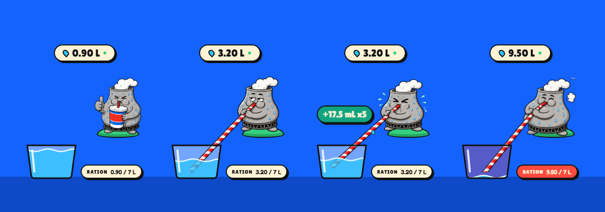

# THIRSTY

A cartoon cooling tower that lives on your desktop and takes a sip every time an AI answers you.
Claude Code, Codex and AI chats in your browser all count. He has a daily ration. Keep him under
it, build a streak, heal his planet, collect badges.



## Download

| | File |
|---|---|
| Windows 10 and 11 | [THIRSTY-Setup.exe](https://github.com/coolingloop/thirsty-widget/releases/latest/download/THIRSTY-Setup.exe) (or the [portable exe](https://github.com/coolingloop/thirsty-widget/releases/latest/download/THIRSTY-Portable.exe), no install) |
| Mac with Apple Silicon (M1 or newer) | [THIRSTY-mac-arm64.dmg](https://github.com/coolingloop/thirsty-widget/releases/latest/download/THIRSTY-mac-arm64.dmg) |
| Mac with Intel | [THIRSTY-mac-x64.dmg](https://github.com/coolingloop/thirsty-widget/releases/latest/download/THIRSTY-mac-x64.dmg) |
| Chrome extension (web chats) | [thirsty-extension.zip](https://github.com/coolingloop/thirsty-widget/releases/latest/download/thirsty-extension.zip) |

Every release lists SHA-256 checksums in `SHA256SUMS.txt`, and every file is built from this
repository by the public [release workflow](.github/workflows/release.yml). Nothing is built on
anyone's laptop.

## Installing

The apps are not code-signed yet (a Windows certificate and an Apple Developer ID cost money every
year), so both systems ask you to confirm once.

**Windows**
1. Run `THIRSTY-Setup.exe`.
2. If a blue "Windows protected your PC" box appears, click **More info**, then **Run anyway**.
3. THIRSTY installs for your user only (no admin prompt) and appears bottom right, above the taskbar.

**Mac**
1. Open the `.dmg` and drag THIRSTY into Applications.
2. Open THIRSTY. macOS says it cannot check the app for malicious software. Click **Done**.
3. Open **System Settings**, then **Privacy & Security**. Scroll down to the message about THIRSTY
   and click **Open Anyway**, then confirm with your password or Touch ID.
4. He lives in the menu bar (a small tower icon) and on your desktop. No Dock icon.

**Chrome extension** (counts prompts on claude.ai, chatgpt.com, Gemini, Perplexity, Copilot, Grok,
DeepSeek, Mistral and AI Studio)
1. Download `thirsty-extension.zip` and unzip it.
2. Open `chrome://extensions` and switch on **Developer mode** (top right).
3. Click **Load unpacked** and pick the unzipped folder.

The desktop app has to be running for web sips to reach him. While it is closed, the extension
keeps the counts and hands them over later.

## What it does on your computer

All of it is readable in a few small files:

- **Reads** your local AI logs, read-only: `~/.claude/projects` (Claude Code) and `~/.codex/sessions`
  (Codex). It counts replies and prompts and never stores the text. See `widget/engine/parsers.js`.
- **Writes** only its own folder: `%APPDATA%\Thirsty` on Windows, `~/Library/Application Support/Thirsty`
  on Mac (daily counts, settings, file offsets).
- **Listens** on `127.0.0.1:47821`, your own machine only, so the Chrome extension can hand over web
  sips. See `widget/engine/api.js`. It accepts events only from Chrome extensions.
- **Sends nothing** anywhere. There is no analytics, no telemetry, no update server and no account.
  The only outside links (the two water sources) open in your browser when you click them.

The extension has three permissions: `storage`, the loopback address `127.0.0.1`, and content
scripts on the AI chat sites and `localhost` pages. No tabs, history or cookies permission. It never reads your prompts
beyond a throwaway hash that stops double counting, and it never sends them anywhere.

Don't trust us, check it: read `widget/main.js`, `widget/engine/` and `extension/`, build it
yourself (below), or compare the checksums of your download with `SHA256SUMS.txt`.

## How the water is counted

Every reply is weighed by its own tokens. Energy comes from the tokens it reads and writes (fresh
input, cached input, output and reasoning) and the size of the model; water comes from that energy
for the cloud that serves it, cooling water on site plus the water power plants evaporate. A short
chat answer is about 1 mL; a coding-agent turn that re-reads a 300,000-token project can be 50 mL.
The numbers are anchored on Google's measured 0.24 Wh median Gemini prompt, OpenAI's 0.34 Wh average
ChatGPT query and Epoch AI's estimates, with per-cloud water factors from Jegham et al. and Berkeley
Lab. Full method, every number and its source: [WATER-MODEL.md](WATER-MODEL.md).

As lifetime water grows he unlocks milestones, from a glass (0.25 L) through a bathtub (150 L) and
a fire truck (3,000 L) to an Olympic pool (2.5 million L).

Plain chats in the Claude and ChatGPT desktop apps leave no local log, so they cannot be counted.
Their Claude Code and Codex sessions are.

## Build it yourself

You need Node.js 22 or newer.

```
cd widget
npm ci
npm test                 # engine unit tests
npm start                # run from source
npm run dist:win         # Windows installer + portable exe in widget/dist (on Windows)
npm run dist:mac         # Mac dmg + zip in widget/dist (on a Mac)
npm run smoke            # launches the packaged app against fake logs and checks it counts
```

The extension needs no build step: `extension/` is the unpacked extension.

## Layout

- `widget/` the Electron desktop app: `main.js` (windows, tray), `engine/` (log readers, counts,
  local API), `renderer/` (the pet and the dashboard), `test/`.
- `extension/` the Chrome MV3 extension: `sites.js` (one selector table for the chat sites),
  `content.js` (spots a sent prompt), `sw.js` (queues and delivers counts), `bridge.js` (shows your
  stats to pages on `localhost`).
- `.github/workflows/release.yml` builds, tests and publishes every release.

## Licence

MIT, see [LICENSE](LICENSE). Fonts: Lilita One and Fredoka under the SIL Open Font Licence.
